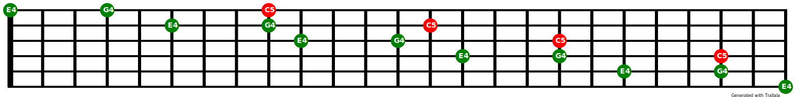

# Create a chord diagram

Create a chord diagram with all possible voicings.

## 12 Fret Diagram with Notes/ PitchClass Names 

``` python
--8<-- "examples/guitar_fretboard_chord_Cmaj_pitchclasses.py"

```

### Result


## 12 Fret Diagram for a Note with Intervals 

``` python
--8<-- "examples/guitar_fretboard_chord_Cmaj_intervals.py"

```

### Result


## 24 Fret Diagram fir Chord with Voicing 

``` python
--8<-- "examples/guitar_fretboard_chord_Cmaj_voicing.py"

```

### Result


